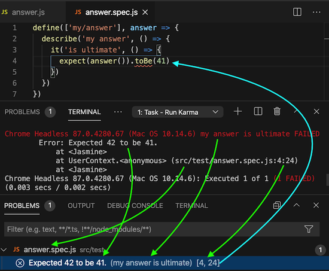

# VS Code Karma Problem Matchers

[][from the marketplace]
[](./LICENSE)
[](https://github.com/prantlf/vscode-karma-problem-matchers/actions)

Capture errors from tests written with [Jasmine], [Mocha] or other test framework and run by [Karma] from [Visual Studio Code].



## Installation

Install this extension to your Visual Studio Code [from the marketplace], or download a specific version of a [released package] and install it from the file.

Make sure that your NPM project depends on the following modules:

* `karma` to support the [Karma] test runner
  * either `karma-jasmine` and `jasmine-core` to support the [Jasmine] test framework
  * or `karma-mocha` and `mocha` to support the [Mocha] test framework
    * either `karma-chai` and `chai` to recognise the [Chai] assertions
    * or `karma-expect` to recognise the [Expect] assertions
    * or `karma-should` and `should` to recognise the [should.js] assertions
    * or `karma-power-assert`, `karma-espower-preprocessor`, `karma-sourcemap-loader` and `power-assert` to recognise the [power-assert] assertions
* and `karma-chrome-launcher` and/or `karma-firefox-launcher` to supply a web browser launcher
* optionally `karma-brief-reporter` to provide other test output than the built-in reporters do

## Configuration

Specify `"$karma-<framework>-<reporter>[-<browser>]"` as a value for the property `problemMatcher` of your testing task in `.vscode/tasks.json`.

Choose the `<framework>` according to the Karma framework that you use for executing the tests. The following frameworks are supported:

* `jasmine` - for the latest version of [Jasmine], which is currently 3
* `jasmine2` - for one of the original versions of [Jasmine 2] compatible with 2.0; more recent versions like 2.99 modified the output to match Jasmine 3
* `jasmine1` - for one of the original versions of [Jasmine 1], which was 1.3.1 the latest
* `mocha-assert` - for [Mocha] with a standard `assert` library like [power-assert], but without the instrumentation of the assertion output
* `mocha-chai` - for [Mocha] with [Chai]
* `mocha-expect` - for [Mocha] with [Expect]
* `mocha-power-assert` - for [Mocha] with [power-assert], with the instrumentation of the assertion output
* `mocha-should` - for [Mocha] with [should.js]

Choose the `<reporter>` according to the Karma reporter that you use for printing the test progress on the console. The following reporters are supported:

* [brief] - a friendly reporter printing just the errors and keeping the progress on one line
* [dots] - a built-in reporter printing just a dot for each executed test
* [progress] - a built-in reporter printing the progress after each test on a new line

The reporter `dots` is supported by the same problem matcher as the reporter `progress`. Use the `progress` value for either of the two reporters.

Choose the `<browser>` according to the Karma launcher that you use for starting the browser. The following frameworks are supported:

* `chrome`
* `firefox`

Some problem matchers work with all browsers using the same implementation. They do not include the `<browser>` in their names. Check the valid values offered by Visual Studio Code when you are editing `.vscode/tasks.json`.

### Run

Run the task "Run Tests" from `.vscode/tasks.json` to run the tests once and exit:

```json
{
  "version": "2.0.0",
  "tasks": [
    {
      "label": "Run Tests",
      "type": "shell",
      "command": "./node_modules/.bin/karma start",
      "windows": {
        "command": ".\\node_modules\\.bin\\karma start"
      },
      "problemMatcher": "$karma-jasmine-progress"
    }
  ]
}
```

### Watch

Run the task "Watch Tests" from `.vscode/tasks.json` to run the tests once and wait for file changes to re-run the tests again and again:

```json
{
  "version": "2.0.0",
  "tasks": [
    {
      "label": "Watch Tests",
      "type": "shell",
      "command": "./node_modules/.bin/karma start --auto-watch --no-single-run",
      "windows": {
        "command": ".\\node_modules\\.bin\\karma start --auto-watch --no-single-run"
      },
      "isBackground": true,
      "problemMatcher": "$karma-jasmine-progress"
    }
  ]
}
```

### Debug

Start the launcher "Debug Tests" from `.vscode/launch.json` to debug the tests using the extension "Debugger for Chrome" in the headless mode:

```json
{
  "version": "0.2.0",
  "configurations": [
    {
      "type": "chrome",                // as soon as Karma starts, attach
      "request": "attach",             // to the headless Chrome
      "name": "Debug Tests",
      "port": 9222,                    // default Chrome debugging port
      "webRoot": "${workspaceFolder}",
      "pathMapping": {
        "/": "${workspaceRoot}/",      // Karma serves the project base 
        "/base/": "${workspaceRoot}/"  // directory as on the /base path
      },
      "preLaunchTask": "Watch Tests"   // re-run the tests on file changes
    }
  ]
}
```

### Karma

Karma configuration that will run the tests by default and watch for file changes and re-run the tests when the arguments `--auto-watch --no-single-run` are used:

```js
module.exports = function(config) {
  config.set({
    basePath: '.',
    frameworks: ['jasmine'], // load and execute Jasmine tests
    files: ['src/**/*.js'],
    reporters: ['progress'], // choose brief, dots, mocha, progress or specs
    port: 9876,
    browsers: ['ChromeHeadless'], // do not open the browser window
    autoWatch: false, // run the tests one by just `karma start` and flip
    singleRun: true   // those on the command line to continue watching
  })
}
```

### Problem Matchers

All problem matchers introduced by this package alphabetically: `karma-jasmine-brief`, `karma-jasmine1-brief-chrome`, `karma-jasmine1-brief-firefox`, `karma-jasmine2-brief-chrome`, `karma-jasmine2-brief-firefox`, `karma-jasmine-progress`, `karma-jasmine1-progress-chrome`, `karma-jasmine1-progress-firefox`, `karma-jasmine2-progress-chrome`, `karma-jasmine2-progress-firefox`, `karma-mocha-assert-progress`, `karma-mocha-chai-progress-chrome`, `karma-mocha-chai-progress-firefox`, `karma-mocha-expect-progress`, `karma-mocha-power-assert-progress`, `karma-mocha-should-progress`

## Example

You can have a look at a [testing project example]. It is meant for testing the problem matchers and not to demonstrate an actual library, but it might help you to set up your project and your tasks and launchers, although is contains many tasks for investigation purposes.

[Visual Studio Code]: https://code.visualstudio.com/
[from the marketplace]: https://marketplace.visualstudio.com/items?itemName=prantlf.karma-problem-matchers
[released package]: https://github.com/prantlf/vscode-karma-problem-matchers/releases
[testing project example]: ./example
[Jasmine]: https://jasmine.github.io/
[Jasmine 2]: https://github.com/jasmine/jasmine/tree/v2.0.0#readme
[Jasmine 1]: https://github.com/jasmine/jasmine/tree/v1.3.1#readme
[Mocha]: https://mochajs.org/
[Karma]: https://karma-runner.github.io/latest/index.html
[Chai]: https://www.chaijs.com/
[Expect]: https://github.com/Automattic/expect.js#readme
[should.js]: https://github.com/shouldjs/should.js#readme
[power-assert]: https://github.com/power-assert-js/power-assert#readme
[brief]: https://github.com/prantlf/karma-brief-reporter#readme
[dots]: http://karma-runner.github.io/5.2/config/configuration-file.html
[progress]: http://karma-runner.github.io/5.2/config/configuration-file.html
